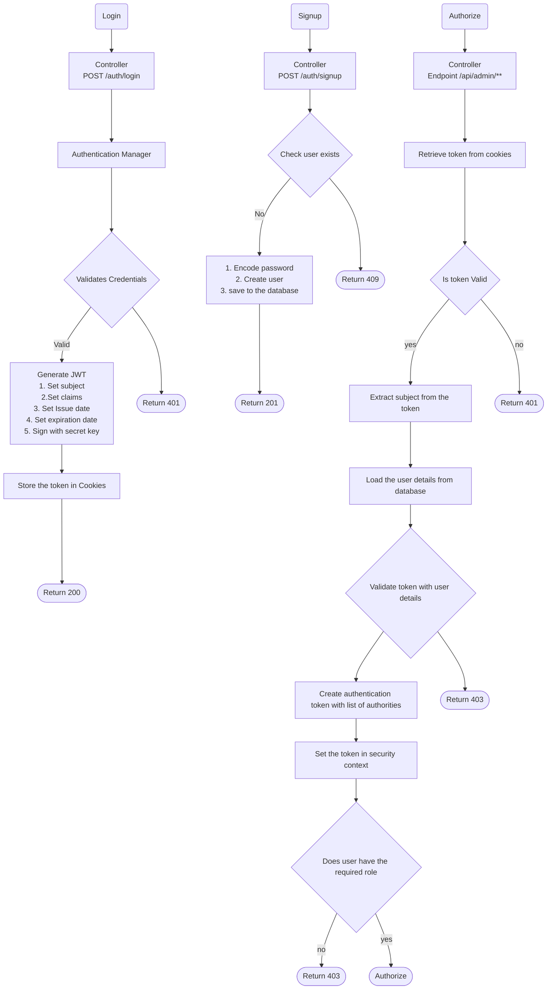

# JWT-BASED-USER-AUTHENTICATION-SYSTEM
- user securely login using Json-Web-Token
- role based access control
- tokens are stored in cookies

## ARCHITECTURE DIAGRAM

```mermaid
---
config:
  theme: mc
  layout: dagre
---
flowchart TB
    n1["Login"] --> n2["Controller<br>POST /auth/login"]
    n2 --> n3["Authentication Manager"]
    n3 --> n4["Validates Credentials"]
    n4 -- Valid --> n5["Generate JWT<br>1. Set subject<br>2.Set claims<br>3. Set Issue date<br>4. Set expiration date<br>5. Sign with secret key"]
    n5 --> n6["Store the token in Cookies"]
    n6 --> n7["Return 200"]
    n8["Signup"] --> n9["Controller<br>POST /auth/signup"]
    n9 --> n10["Check user exists"]
    n10 -- No --> n13["1. Encode password<br>2. Create user<br>3. save to the database"]
    n13 --> n12["Return 201"]
    n14["Authorize"] --> n15["Controller<br>Endpoint /api/admin/**"]
    n15 --> n16["Retrieve token from cookies"]
    n16 --> n19["Is token Valid"]
    n18["Create authentication token with list of authorities"] --> n20["Set the token in security context"]
    n19 -- yes --> n17["Extract subject from the token"]
    n19 -- no --> n22["Return 401"]
    n23["Does user have the required role"] -- no --> n24["Return 403"]
    n4 --> n25["Return 401"]
    n10 --> n26["Return 409"]
    n17 --> n27["Load the user details from database"]
    n27 --> n28["Validate token with user details"]
    n28 --> n18 & n29["Return 403"]
    n20 --> n23
    n23 -- yes --> n21["Authorize"]

    n1@{ shape: event}
    n4@{ shape: decision}
    n7@{ shape: terminal}
    n8@{ shape: event}
    n10@{ shape: decision}
    n12@{ shape: terminal}
    n14@{ shape: event}
    n19@{ shape: decision}
    n22@{ shape: terminal}
    n23@{ shape: decision}
    n24@{ shape: terminal}
    n25@{ shape: terminal}
    n26@{ shape: terminal}
    n28@{ shape: decision}
    n29@{ shape: terminal}
    n21@{ shape: terminal}
```